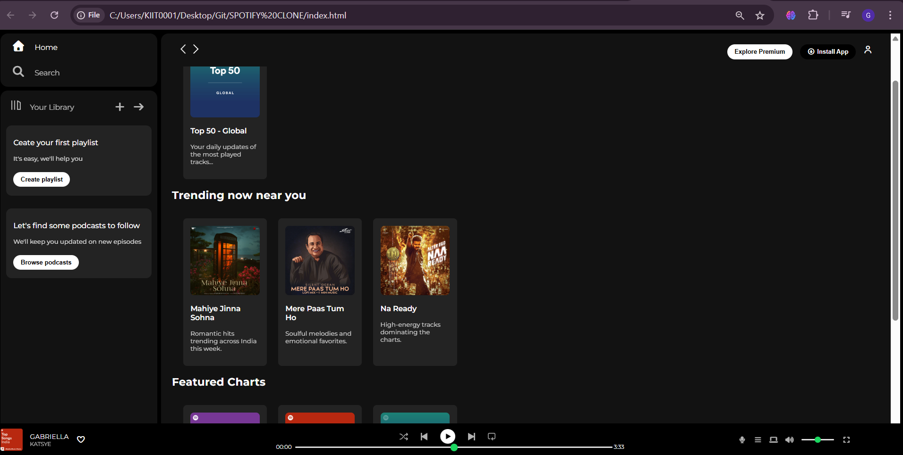

#🎵 Spotify Clone

A responsive front-end clone of the Spotify Web Player built using HTML5 and CSS3.

This project recreates Spotify’s core UI layout, including sidebar navigation, content sections, and a fully designed music player with playback and volume controls.

#🚀 Tech Stack

HTML5

CSS3

Flexbox

Font Awesome

#✨ Key Features

Structured layout using Flexbox

Sticky top navigation bar

Trending & Featured music sections

Custom-styled playback progress bar

Volume control slider

Responsive UI design

📸 Project Preview

#📌 Author

Palak Gautam
